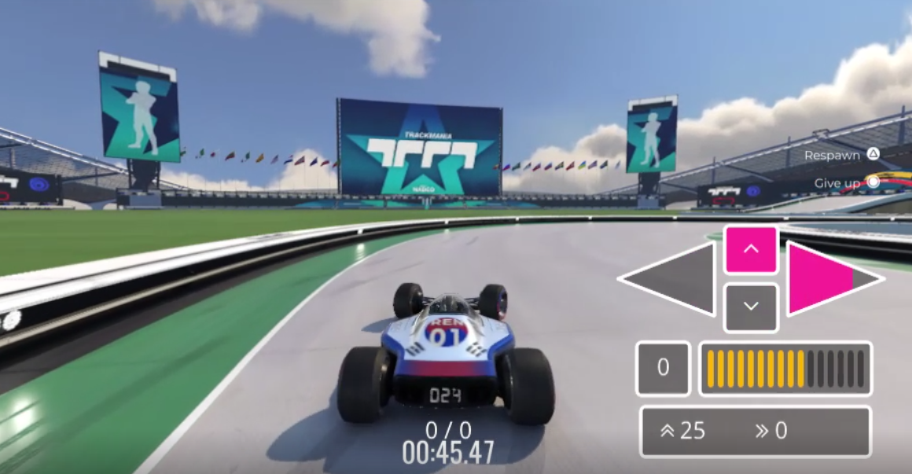

# Trackmania Agent with Deep Reinforcement Learning :racing_car:

** Change this to a cool gif :rofl: **

## Introduction

I pondered what would be the best way to enter the reinforcement learning world, and arrived at the conclusion to be an `agent` myself in the `environment of learning`, making observations, refining my actions, and seeking greater rewards(which is world domination, no I'm joking, knowledge and appreciation of all the great works being produced.)

Especially, as a deep learning engineer, I am interested in the use of neural networks as approximators for value functions or policy functions. This project, in turn, aims to get a `neural agent`(it sounds like a weapon, but that would be a nerve agent :laughing:) to successfully navigate through various meandering tracks that Trackmania can offer.

## Details

There are a few goals that I'd like to achieve from this project

- Get used to the **general workflow of managing a DRL project**

- Understand and fully implement the concepts behind [**Soft Actor Critic**](https://arxiv.org/abs/1801.01290) (Haarnoja et al. 2018)

- Make it **as 'human' as possible**. Only receive sequences of screenshots of the game as the agent's observation. Rewards should be based on time, speed, or trying to imitate the world record runs.

- Create a **working** [**JAX**](https://github.com/google/jax) **-only framework** in designing and training the neural networks (No hard feelings against [Flax](https://github.com/google/flax) or [Haiku](https://github.com/deepmind/dm-haiku), just wanted to try it myself!). Btw, JAX is awesome(it has “una anima di pura programmazione funzionale”). Please go check it out on the link!

- Make it into a great pilot episode that will serve as a scene setter for my RL journeys ahead; where I'd love to delve into **multi-agent learning and cooperation**.

## Setup

I usually work on an Ubuntu workstation, but Trackmania(2020) is a Windows game. I didn't want to mess around with Wine or Lutris, etc. So I just made the other things work on Windows XD. [Here](https://github.com/renardyreveur/trackmania-rl/blob/master/READMEs/setup.md) is a summary of the setup! WSL helps me cope with the separation :wink:

## Acknowledgements

I mean I could list the whole list of references and open source projects that I've explored here, but I've pretty much mentioned most of them(with links) in the various parts of different READMEs, so please check them out! The world is awesome.

If you have any questions about the project or would like to contribute, please feel free to submit an issue, PR, or send me a DM on Twitter([@jeehoonlerenard](https://twitter.com/jeehoonlerenard))