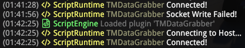
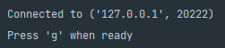

# Trackmania RL Setup

## Prerequisites

- **TrackMania**(2020)
  - Download from Ubisoft or Epic Games store
  - You don't need the Standard or Club editions unless you want to further customize the plugin script


- **Openplanet**
  - Trackmania isn't complete without the 'advanced extension platform' created by [Melissa](https://github.com/sponsors/codecat?o=esc) and the Trackmania community. Openplanet is required to run [the plugin](https://github.com/renardyreveur/trackmania-rl/tree/master/openplanet-plugin) that retrieves various game/vehicle states from Trackmania and sends it to the Python script that is 'Trackmania-RL'.
  - Install it from [openplanet.dev](https://openplanet.dev/download)


- **NVIDIA CUDA and cuDNN**
  - JAX isn't shipped with CUDA or CuDNN,so you need to install it yourself: [CUDA](https://developer.nvidia.com/cuda-toolkit), [cuDNN](https://developer.nvidia.com/cudnn)
  - Make sure the CUDA paths and other environmental variables are set correctly for your OS


- **JAX**
  - The neural agent is made with JAX(everybody's favourite numpy on steroids). To install JAX follow the instructions on [JAX Github](https://github.com/google/jax)
  - Make sure you install the version with CUDA if you plan on using hardware acceleration.
  - Installing JAX on windows (with CUDA support) is a bit of a hassle, but fortunately the folks at [jax-windows-builder](https://github.com/cloudhan/jax-windows-builder) have taken the time and effort to release pre-built packages as a wheel file. Use 'The ultimate solution' written down on their README. This will install jaxlib, and you will have to `pip install jax` as well. For newer versions of JAX, you can try building from source, etc.
  - When importing the jax module, Python on Windows might have a problem looking for the CUDA and cuDNN dlls. As a workaround, add these lines(change accordingly) before importing jax
  
  ```python
  import os
  os.add_dll_directory("C:/Program Files/NVIDIA GPU Computing Toolkit/CUDA/v11.6/bin")
  os.add_dll_directory("C:/Program Files/NVIDIA/CUDNN/v8.3/bin")
  ```
 
 
- **vgamepad and ViGEm driver**
  - The 'agent' is controlled by a virtual gamepad using the python library [vgamepad](https://github.com/yannbouteiller/vgamepad). It's made by [Yann Bouteiller](https://github.com/yannbouteiller), who also has a great project on a ['distributed framework for training Deep RL in real-time applications'](https://github.com/trackmania-rl/tmrl), so check that out too!
  - `vgamepad` uses the [Virtual Gamepad Emulation Framework](https://github.com/ViGEm) (ViGEm), and when installing `vgamepad` the installer for the `Nefarious Virtual Gamepad Emulation Bus` will open up. Unlike its name, it's a legitimate project made with a lot of effort from [Nefarious](https://github.com/nefarius) and the community, so you don't have to worry about it when installing it.


- **Other Python packages**
  - are listed in `requirements.txt`
  - This project was developed using `python 3.8`

<br/><br/>

## Game Setup

### Loading the Openplanet plugin

Once you have Trackmania and Openplanet installed on your system, try the game out; it's a lot of fun!

Openplanet will have created a folder at

`C:\Users\<user_name>\OpenplanetNext\Plugins`

which holds custom plugins that will be loaded into the game. 

**Copy and paste the `openplanet-plugin` folder into the `Plugins` folder**, and once you start Trackmania you'll be able to see the plugin on the Openplanet toolbar under the name of `TM Data Grabber` as seen in the below screenshot.


The plugin should automatically be loaded when the game starts, but if it hasn't, load the plugin with the `Load plugin` tab.

<br/><br/>

### Running the Python Script

The `main.py` script does three things
  1. You can set the run parameters at the top of the script
  2. It automatically resizes and positions the Trackmania window to a quarter of the monitor size on the top left, and activates the window
  3. It starts three processes
     1. `screengetter` which captures screenshots of the game at given intervals
     2. `datagrabber` which acts as a socket server for the `openplanet-plugin` client to connect to. It receives data from the plugin and populates the metrics queue. As this process starts, the `openplanet-plugin` socket client will automatically connect to the socket server.
     3. `controller` which is the script that handles the virtual gamepad inputs to control the Trackmania agent.
     
>Whenever you restart the python script, you need to manually reload the plugin using the openplanet toolbar

>You can check if the socket connections are working by checking the openplanet logs. 
> 
> 
> 
>It will say `Socket Write Failed!`. Try reloading the plugin if that is the case.

Once `main.py` is on a roll, you'll see this on your terminal:



That is your cue to let the magic happen! Press that `g` key and see ~~a ghost driving your car into walls~~ your agent do its thang!

<br/><br/>

### Training Data Accumulation

** TO BE ADDED **